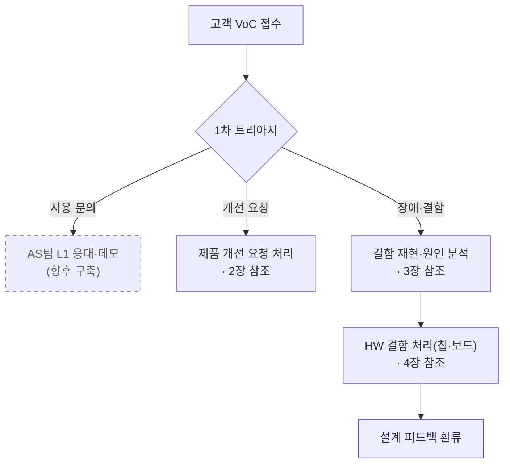
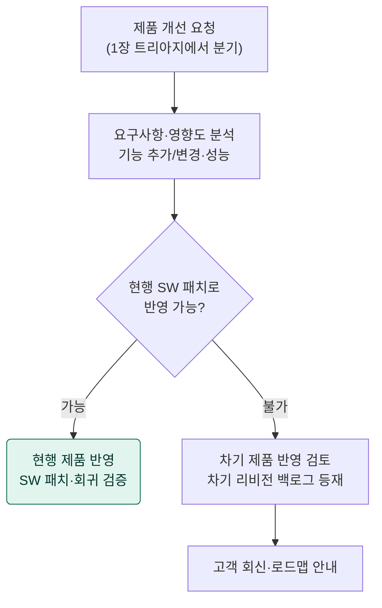
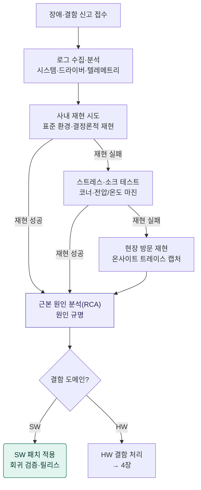
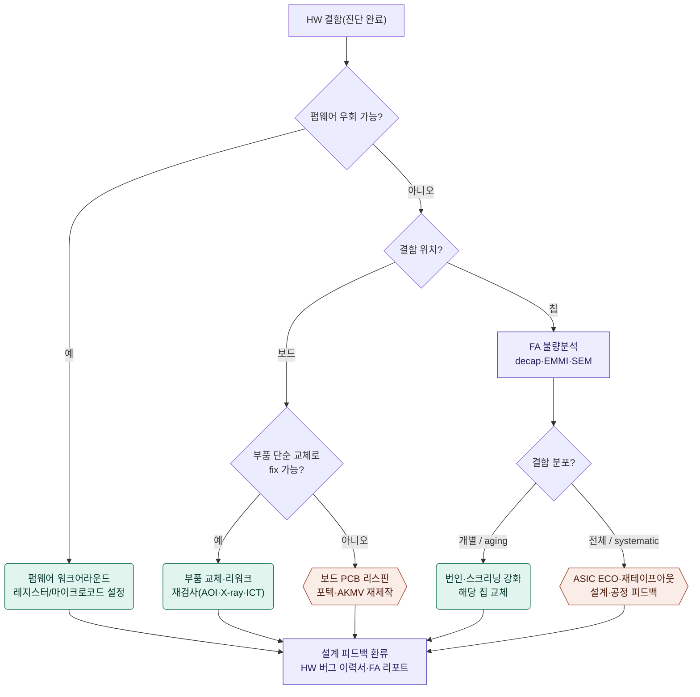

# VDPU 칩/보드 고객불만(VoC) 처리 프로세스

- IPO 기술특례(AI 인프라 트랙) 품질관리·고객대응 평가 대응 자료
- 대상 제품: VDPU — V110 SoC 기반 PCIe 가속 카드 / Evaluation Board
- 작성 기준: 시제품(PoC) 단계. "현재 운영" 프로세스와 "향후 구축(양산 대비)" 프로세스를 구분 표기.

---

## 0. 개요

디노티시아는 자체 생산라인이 없는 외주 위탁생산(Fabless) 구조이므로, 고객불만 처리는 **접수 → 분류 → 재현·원인 분석 → 결함 처리·환류**의 흐름으로 운영한다. 본 문서는 이 흐름을 세 개의 세부 다이어그램으로 나누어 정의하고, 각 다이어그램의 모든 항목(노드·분기)을 풀어서 설명한다.

전담 고객 조직(고객관리팀·AS팀)과 VoC 티켓팅·이력 시스템은 현재 미보유로, 2029~2030년(늦어도 내년 말) 구축 전제로 표기한다. 그 외 진단·재현·FA·ECO·보드 재설계·환류는 시제품(PoC) 단계에서 실제 운영 중인 프로세스다.

### 범례

| 표기 | 의미 |
|---|---|
| 실선 노드 | 현재(PoC·시제품 단계) 운영 중인 프로세스 |
| 점선 노드(`향후 구축`) | 미보유 — 양산 대비 향후 구축 전제 |
| 사각형 노드 | 일반 처리·분석 단계 |
| 마름모 `{ }` | 판정(분기) 노드 |
| 둥근 사각형(초록 계열) | 해소·반영(정상 종결) 경로 |
| 육각형(주황 계열) | 재설계·재제작(중대 변경) 경로 |
| 사각형(보라 계열) | 분석·환류 프로세스 |

---

## 1. 전체 개요 (Phase Map)

고객 VoC는 1차 트리아지에서 세 갈래(사용 문의 / 개선 요청 / 장애·결함)로 분기한다. 단순 사용 문의는 L1 응대로 종결되고, 개선 요청과 장애·결함은 각각 별도 절차로 진입하며, HW 결함의 모든 처리 결과는 설계 피드백 루프로 수렴한다.

### 항목 설명

- **고객 VoC 접수** — PoC 현장, 고객 문의 채널, AS 요청, HW 벤더 채널 등으로 들어오는 모든 의견(VoC, Voice of Customer)을 단일 창구로 접수한다. 시제품 단계이므로 정식 티켓팅 시스템은 향후 구축 대상이며, 현재는 기술관리팀·SoC팀 채널로 수집한다.
- **1차 트리아지 · 디스패치** — 접수 건을 ① 단순 사용 문의, ② 제품 개선 요청, ③ 장애·결함 신고로 분류하고 담당으로 디스패치한다. 분류 기준은 "현재 제품의 결함인가 / 사용 방법 문의인가 / 신규·향상 요구인가"이다.
- **AS팀 L1 응대·데모** `향후 구축` — "특정 모델 구동 여부" 등 사용·구동 방법 문의로, 결함이 아닌 1차(L1) 지원이다. AS팀이 데모 카드 제공·설치·사용 안내로 대응한다. 전담 AS팀은 현재 미보유로 향후 구축 전제다.
- **제품 개선 요청 처리 (→ 2장)** — 기능 추가/변경·성능 개선 등 향상 요구는 2장 절차로 진입한다.
- **결함 재현·원인 분석 (→ 3장)** — 오작동·장애·성능 미달 등 결함성 신고는 3장의 재현·RCA 절차로 진입한다.
- **HW 결함 처리(칩·보드) (→ 4장)** — RCA 결과 HW 결함으로 판정된 건은 4장의 칩/보드 처리 절차로 넘어간다.
- **설계 피드백 환류** — HW 결함 처리의 모든 결과는 HW 버그 이력서·FA 리포트로 등재되어 설계/검증/공정으로 환류된다(4장 상세).

---

## 2. 제품 개선 요청 처리

1장 트리아지에서 "개선 요청"으로 분기된 건을 처리하는 절차다. 현행 제품에 SW 패치로 반영 가능한지에 따라 현 제품 반영과 차기 제품 로드맵 반영으로 나뉜다.

### 항목 설명

- **제품 개선 요청** — 1장 트리아지에서 기능 추가/변경·성능 개선 요구로 분류되어 본 절차로 진입한 건이다.
- **요구사항·영향도 분석** — 개선 요구를 요구사항으로 정형화하고, SW/HW 영향도·호환성·검증 범위·일정을 평가한다.
- **현행 SW 패치로 반영 가능?** — 현행 V110 실리콘·보드 제약 내에서 펌웨어/드라이버/런타임(dn-knowhere 등) 패치만으로 요구를 충족할 수 있는지 판정한다. HW·아키텍처 변경이 필요하면 "불가"로 분기한다.
- **현행 제품 반영 (SW 패치·회귀 검증)** — 패치 가능 시 핫픽스/마이너 릴리스로 반영하고, 회귀(regression) 검증을 거쳐 배포한다.
- **차기 제품 반영 검토 (백로그 등재)** — 현행 불가 항목은 차기 SoC/보드 리비전 백로그에 등재하여 차기 제품 설계에 반영을 검토한다.
- **고객 회신 · 로드맵 안내** — 차기 반영 여부·예상 일정을 정리하여 고객에게 회신한다.

---

## 3. 결함 재현 및 근본 원인 분석(RCA)

### 항목 설명

- **장애·결함 신고 접수** — 1장 트리아지에서 결함으로 분류된 건을 접수한다.
- **로그 수집·분석** — 시스템 로그, 커널/dmesg, VDPU 드라이버 트레이스, 런타임 텔레메트리, dn-knowhere·Vector DB 로그를 수집해 1차 분석한다. 오류 코드·타임라인·재현 조건의 단서를 추출한다.
- **사내 재현 시도** — 표준 검증 환경(동일 서버·드라이버·펌웨어 버전)에서 결정론적 재현을 시도한다. 재현되면 곧바로 RCA로 진입한다.
- **스트레스·소크 테스트** — 사내 재현 실패 시, 장시간 소크(soak)·고부하·코너케이스·전압/온도 마진 조건을 가해 간헐적(intermittent) 결함을 유도한다. 재현되면 RCA로 진입한다.
- **현장 방문 재현** — 그래도 미재현 시 온사이트에서 실환경 트레이스·로그를 캡처하고, 고객 워크로드·서버 구성·환경 차이를 확인하여 재현한다.
- **근본 원인 분석(RCA)** — 확보한 재현 데이터를 바탕으로 근본 원인을 규명하고, 결함 도메인(SW/HW)을 판정한다.
- **결함 도메인?** — 원인이 SW(드라이버·런타임·펌웨어 로직)인지 HW(보드·칩 물리 결함)인지 분기한다.
- **SW 패치 적용** — SW 결함이면 드라이버/런타임/펌웨어를 수정하고, 회귀 검증 후 릴리스한다.
- **HW 결함 처리 (→ 4장)** — HW 결함이면 4장의 칩/보드 처리 절차로 넘긴다.

---

## 4. HW 결함 처리 — 칩 / 보드

### 항목 설명

- **HW 결함(진단 완료)** — 디버그 포트(JTAG·UART·I2C) 등으로 HW 결함이 확인된 상태에서 시작한다.
- **펌웨어 우회 가능?** — 레지스터/마이크로코드/펌웨어 설정 변경으로 결함을 회피할 수 있는지 판정한다. HW 변경 없이 해소 가능한 경우를 먼저 거른다.
- **펌웨어 워크어라운드** — 우회 가능 시 펌웨어 패치(레지스터 설정·마이크로코드 등)로 회피하고, 검증 후 종결한다.
- **결함 위치?** — 우회 불가 시 결함이 보드(Eval/PCIe 카드)에 있는지 칩(V110 SoC)에 있는지 판정한다.
- **부품 단순 교체로 fix 가능?** — 보드 결함이 특정 부품(수동 소자, 커넥터, DC-DC/PMIC 모듈, 소켓, 리워크 가능 능동 소자 등)의 단일 고장·실장 불량(콜드 솔더·틀어짐 등)에 기인하여, 해당 부품 교체·리워크만으로 해소되는지 판정한다.
- **부품 교체·리워크 (재검사)** — 교체로 해소 가능하면 해당 부품을 교체·리워크한 뒤 재검사(AOI·X-ray·ICT)로 확인하고, 보드 재제작 없이 종결한다. 조립·솔더 불량이나 단일 부품 고장 케이스에 해당한다.
- **보드 PCB 리스핀 (재제작)** — 설계·레이아웃·신호/전력 무결성(SI/PI)·전원 설계 등 구조적 결함이면 보드를 재설계(리스핀)하고, 포텍(Layout)·AKMV(PCB 제조)로 재제작한다.
- **FA 불량분석** — 칩 결함이면 decap(개봉)·EMMI(포토에미션)·SEM·락인 서모그래피 등으로 물리적 고장 위치·메커니즘을 분석한다(SoC팀 검증 파트 + ASICLAND).
- **결함 분포?** — FA 결과로 결함이 특정 칩에 국한된 개별(random·aging·번인 escape) 불량인지, 모든 칩에 나타나는 전체(systematic) 결함인지 판정한다.
- **번인·스크리닝 강화 (개별/aging)** — 개별 칩 문제면 번인(Burn-in) 조건 상향·스크리닝/게이팅(speed·power bin) 강화로 불량을 사전 탈락시키고, 해당 칩을 교체한다.
- **ASIC ECO·재테이프아웃 (전체/systematic)** — 설계·공정에 기인한 전체 결함이면 metal/base-layer ECO·재테이프아웃을 진행하고, 공정 파라미터를 파운드리·ASICLAND로 피드백한다.
- **설계 피드백 환류** — 위 모든 HW 대응 결과(워크어라운드·부품 교체·리스핀·스크리닝·ECO)를 HW 버그 리스트·수정 이력서·FA 리포트에 등재하고 설계/검증/공정으로 환류한다. 8-1 웨이퍼 FA 수율 피드백, 11단계 포스트-실리콘 검증과 연계된다.

---

## 5. 유지 관리 문서·서류 목록

위 프로세스를 운영하고 IPO 평가에서 증빙하기 위해 유지해야 하는 문서·서류를 단계별로 정리한다.
현황 표기 — **○** 현재 보유·운영 / **△** 부분 보유(표준 양식·체계 정립 필요) / **◇** 향후 구축(양산 대비).

### 5.1 공통 · 관리 체계 (QMS)

| 문서·서류 | 설명 | 현황 |
|---|---|---|
| 고객불만 처리 절차서(SOP) | 본 프로세스 전체를 표준화한 절차서. 트리아지·에스컬레이션·종결 기준 정의 | △ |
| 트리아지·심각도(Severity) 분류 기준서 | 사용문의/개선요청/결함 분류 및 우선순위 등급 정의 | △ |
| 책임·권한 매트릭스(RACI) | 단계별 담당(SoC팀 HW플랫폼·검증·설계, CORE팀, DB팀, AS팀, 기술관리팀, 외주사) 지정 | △ |
| VoC 접수·처리 대장(티켓) | 접수일·채널·고객·증상·분류·담당·상태·종결일 기록. 시스템화는 향후 | ◇ |
| 제품 이력 카드(S/N 트레이서빌리티) | 카드별 칩 lot·보드 리비전·펌웨어/드라이버 버전 추적 | △ |
| 품질지표(KPI) 관리대장 | 접수~종결 리드타임, 재현율, 재발률, FA TAT 등 | ◇ |
| 문서·기록 관리 절차(보유기간 포함) | 문서 마스터 리스트·개정 이력·보존기간 관리 (ISO 7.5.2/7.5.3) | △ |
| 역량·교육 훈련 기록 | QA·AS·진단 인력 자격 요건·교육·OJT 이력 (ISO 7.2) | △ |
| 측정자원 교정·검증 기록 | 오실로스코프·ATE·X-ray·AOI·멀티미터 등 교정·검증 이력 (ISO 7.1.5) | △ |
| 위험·기회 관리(리스크 등록부) | 결함·설계 리스크 식별·대응 및 설계 위험 분석(FMEA 등) (ISO 6.1/8.3.3) | △ |
| 변경 관리(MOC) 절차 | ECO·보드 리비전·SW 변경을 포괄하는 통합 변경 통제 (ISO 8.5.6/8.3.6) | △ |
| 부적합품 관리·격리 기록 | 불량 칩/보드 식별·격리·처분(특채 포함) 기록 (ISO 8.7) | △ |
| 고객 만족도 모니터링 기록 | VoC와 별개의 고객 만족도 측정·분석 (ISO 9.1.2) | ◇ |
| 경영 검토(Management Review) 기록 | 고객불만·현장 고장을 검토 입력으로 한 경영진 검토 (ISO 9.3) | ◇ |
| 내부 심사(Internal Audit) 프로그램·보고서 | QMS·프로세스 내부 심사 계획·실시·결과 (ISO 9.2) | ◇ |

### 5.2 제품 개선 요청 (2장)

| 문서·서류 | 설명 | 현황 |
|---|---|---|
| 개선 요청서(Change/Feature Request) 대장 | 기능 추가/변경·성능 요구사항 접수·이력 관리 | △ |
| 영향도·실현성 분석 보고서 | SW/HW 영향, 호환성, 검증 범위·일정 평가 결과 | ○ |
| SW 릴리스 노트·버전 관리대장 | 펌웨어/드라이버/런타임 패치 내역 및 버전 이력 | ○ |
| 차기 제품 리비전 백로그 | 현행 반영 불가 항목의 차기 SoC/보드 반영 목록 | ○ |
| 고객 회신·로드맵 안내 기록 | 반영 여부·일정 회신 내역 | △ |

### 5.3 결함 재현 · 원인 분석 (3장)

| 문서·서류 | 설명 | 현황 |
|---|---|---|
| 결함 신고서·티켓 | 고객·제품(S/N)·증상·환경(서버·드라이버·펌웨어 버전) 기록 | △ |
| 로그 수집·분석 기록 | 시스템·커널·드라이버·텔레메트리·DB 로그 아카이브 및 분석 노트 | ○ |
| 재현 시험 기록서 | 사내/스트레스/현장 단계별 재현 절차·환경·결과 | ○ |
| 스트레스·소크 테스트 계획서·성적서 | 코너케이스·전압/온도 마진·장시간 부하 조건과 결과 | ○ |
| 온사이트(현장) 디버깅 보고서 | 실환경 트레이스 캡처, 고객 구성·워크로드 차이 분석 | △ |
| RCA(근본 원인 분석) 보고서 | 원인 규명, 도메인(SW/HW) 판정, 시정·예방 조치 도출 | ○ |
| SW 패치·회귀(Regression) 검증 보고서 | SW 결함 수정 후 회귀 검증 결과 및 릴리스 승인 | ○ |

### 5.4 HW 결함 처리 — 칩 · 보드 (4장)

| 문서·서류 | 설명 | 현황 |
|---|---|---|
| HW 진단 기록 | 디버그 포트(JTAG·UART·I2C) 진단 로그·측정값 | ○ |
| 펌웨어 워크어라운드 적용 이력 | 레지스터/마이크로코드 설정 변경 내역 및 검증 결과 | ○ |
| HW 버그 리스트·수정 이력서 | 모든 HW 결함·대응·수정 이력(11단계 핵심 산출물) | ○ |
| 부품 교체·리워크 작업지시·기록서 | 교체 부품·리워크 공정·작업자 기록 | △ |
| 재검사 성적서(AOI·X-ray·ICT) | 부품 교체/조립 후 검사 결과(ASICLAND 관리) | ○ |
| 보드 ECO·리비전 이력 / 회로도·BOM·Layout 개정본 | PCB 리스핀 시 설계 변경 이력과 9단계 설계 산출물 개정 | ○ |
| 보드 재제작 발주·출하 검사 성적서 | 리스핀 보드 재제작(포텍·AKMV) 발주 및 검사 성적서 | ○ |
| FA(불량분석) 보고서 | decap·EMMI·SEM 등 칩 고장 위치·메커니즘 분석(검증팀·ASICLAND) | ○ |
| 결함 분포 판정 기록 | 개별·aging(random) vs 전체(systematic) 판정 근거 | △ |
| 번인·스크리닝 기준서·시험 성적서 | 번인 조건 상향·스크리닝/게이팅(speed·power bin) 기준과 결과 | △ |
| 칩 교체·RMA 기록 | 불량 칩 교체·반품(RMA) 내역 | ◇ |
| ASIC ECO 보고서·재테이프아웃 체크리스트 | systematic 결함의 metal/base-layer ECO 및 공동 서명 체크리스트(디노티시아+ASICLAND) | ○ |
| 공정 파라미터 피드백 기록 | 파운드리·ASICLAND로의 공정 산포·수율 피드백 이력 | △ |

### 5.5 시정 · 예방 및 종결

| 문서·서류 | 설명 | 현황 |
|---|---|---|
| 설계 피드백 환류 기록 | 설계/검증/공정 반영 이력, 8-1 웨이퍼 FA 수율·11단계 포스트-실리콘 검증 연계 | ○ |
| 시정·예방조치(CAPA) 대장 | 재발 방지 대책·수평전개 관리 | △ |
| 출하·납품 / 교체(RMA) 이력 대장 | 교체 카드 납품·반품 이력 및 평판 관리 | ◇ |
| 고객 종결 회신·만족 확인 기록 | 처리 결과 회신 및 클로징 확인 | △ |
| 외주 협력사 산출물 검토·승인 기록 | ASICLAND·AMKOR·포텍·AKMV·ISC 외주 처리 시 산출물 검토·승인 이력 | ○ |
| 공급자 평가·선정·모니터링 기록 | ASICLAND·AMKOR·포텍·AKMV·ISC 선정·재평가·성과 모니터링 (ISO 8.4.1) | △ |
| 서비스(현장) 피드백 기록 | 현장 서비스·AS 결과의 설계·제조 환류 (ISO 8.5.5) | △ |

> 비고: **△·◇ 항목**은 현재 미정립·미보유로, 2029~2030년(늦어도 내년 말) 구축 전제로 작성한다(IPO "향후 구축 예정" 시나리오). 본 목록은 **ISO 9001:2015** 기준이며, 정식 인증과의 최종 매핑은 인증기관·컨설팅사와 확정한다.

---

## 6. ISO 9001:2015 조항 매핑

> 기준 표준: **ISO 9001:2015**(현행 인증 표준). IATF 16949는 자동차 산업 전용 QMS이므로 본 문서 적용 범위에서 제외한다.
> ISO 9001:2026 개정판은 FDIS 단계로 2026년 9월 발행 예정이나 2015 구조를 유지한 진화적 변경이라 본 매핑은 그대로 유효하다(전환 기한 ~2029년 9월). 아래 조항 번호는 지표이며 최종 매핑은 인증기관·컨설팅사와 확정한다.

### 6.1 목록 항목 → ISO 9001:2015 조항 매핑

| 문서·서류 | ISO 9001:2015 |
|---|---|
| 고객불만 처리 절차서(SOP) | 4.4, 7.5 |
| 트리아지·심각도 기준서 | 8.7, 10.2.1 |
| 책임·권한(RACI) | 5.3 |
| VoC 접수·처리 대장 | 8.2.1, 9.1.2 |
| 제품 이력 카드(S/N 추적) | 8.5.2 |
| 품질지표(KPI) 대장 | 9.1.1, 9.1.3 |
| 문서·기록 관리 절차 | 7.5.2, 7.5.3 |
| 역량·교육 훈련 기록 | 7.2 |
| 측정자원 교정·검증 기록 | 7.1.5 |
| 위험·기회 관리(리스크 등록부) | 6.1, 8.3.3 |
| 변경 관리(MOC) 절차 | 8.5.6, 8.3.6 |
| 부적합품 관리·격리 기록 | 8.7 |
| 고객 만족도 모니터링 기록 | 9.1.2 |
| 경영 검토 기록 | 9.3 |
| 내부 심사 프로그램·보고서 | 9.2 |
| 개선 요청서 대장 | 8.2.1, 8.2.4 |
| 영향도·실현성 분석 보고서 | 8.3.2, 8.5.6 |
| SW 릴리스 노트·버전 관리 | 7.5.3, 8.5.6 |
| 차기 리비전 백로그 | 8.3.2 |
| 고객 회신·로드맵 기록 | 8.2.1 |
| 결함 신고서·티켓 | 8.2.1, 10.2.1 |
| 로그 수집·분석 기록 | 9.1.3, 10.2.1 |
| 재현 시험 기록서 | 8.6, 9.1.1 |
| 스트레스·소크 성적서 | 8.5.1, 9.1.1 |
| 온사이트 디버깅 보고서 | 10.2.1 |
| RCA 보고서 | 10.2.1, 10.2.2 |
| SW 패치·회귀 검증 보고서 | 8.3.4 |
| HW 진단 기록 | 8.5.1, 9.1.1 |
| 펌웨어 워크어라운드 이력 | 8.7, 8.5.6 |
| HW 버그 리스트·수정 이력서 | 10.2.2 |
| 부품 교체·리워크 기록 | 8.7 |
| 재검사 성적서(AOI·X-ray·ICT) | 8.6, 8.7.2 |
| 보드 ECO·리비전·재제작 성적서 | 8.3.6, 8.5.6 |
| FA(불량분석) 보고서 | 10.2.1 |
| 결함 분포 판정 기록 | 10.2.1 |
| 번인·스크리닝 기준서·성적서 | 8.5.1, 8.6 |
| 칩 교체·RMA 기록 | 8.7 |
| ASIC ECO·재테이프아웃 체크리스트 | 8.3.6, 8.5.6 |
| 공정 파라미터 피드백 기록 | 8.4 |
| 설계 피드백 환류 기록 | 8.3.6, 10.3 |
| CAPA(시정·예방조치) 대장 | 10.1, 10.2 |
| 출하·납품 / RMA 이력 대장 | 8.5.2, 8.6 |
| 고객 종결 회신·만족 확인 | 8.2.1, 9.1.2 |
| 외주 산출물 검토·승인 기록 | 8.4 |
| 공급자 평가·선정·모니터링 기록 | 8.4.1 |
| 서비스(현장) 피드백 기록 | 8.5.5 |

### 6.2 적용 범위 조정 및 편입 결과

- **ISO 9001:2015 기준 필수 누락 항목은 모두 5장에 편입**했다 — 문서·기록 관리, 역량·교육, 측정자원 교정, 위험·기회 관리, 변경 관리(MOC), 부적합품 관리, 고객 만족도 모니터링, 경영 검토, 내부 심사(이상 5.1) / 공급자 평가, 서비스 피드백(이상 5.5).
- **IATF 16949 전용 항목은 자동차 산업 전용이므로 적용 범위에서 제외**한다 — 문제해결 8D(10.2.3), 실수 방지·Poka-yoke(10.2.4), 보증·NTF 관리(10.2.5), 비상 대응 계획(6.1.2.3), MSA(7.1.5.1.1), Control Plan·PPAP·양산 승인(8.5.1.1/8.3.4.4). 향후 자동차 고객을 겨냥할 경우에만 재검토한다.

> 정리: 현재 강점은 **설계·검증·FA·ECO 산출물(8.3/8.5/10.2 계열)**로, 결함의 기술적 처리·환류는 잘 갖춰져 있다. 보강이 필요한 부분은 **관리 체계(7.1.5 교정, 7.2 역량, 9.2 내부심사, 9.3 경영검토, 8.7 부적합 통제, 8.4 공급자 관리)**이며, 5장에 편입하여 IPO "향후 구축 예정"으로 명시했다.

---

## 부록. 용어 정리

| 약어 | 풀이 |
|---|---|
| VoC | Voice of Customer — 고객 의견·불만 |
| RCA | Root Cause Analysis — 근본 원인 분석 |
| FA | Failure Analysis — 불량(고장) 분석 |
| ECO | Engineering Change Order — 설계 변경 |
| EMMI | Emission Microscopy — 포토에미션 고장 위치 분석 |
| SEM | Scanning Electron Microscope — 주사 전자 현미경 |
| AOI | Automated Optical Inspection — 자동 광학 검사 |
| ICT | In-Circuit Test — 인서킷 테스트 |
| SI/PI | Signal Integrity / Power Integrity — 신호·전력 무결성 |
| PMIC | Power Management IC — 전원 관리 IC |
| Soak test | 장시간 연속 부하 시험 |
| Random / Systematic defect | 개별(산발) 결함 / 전체(구조적) 결함 |
| Burn-in | 고온·고전압 가속 초기 불량 탈락 시험 |
| Re-spin | 보드/칩의 재설계·재제작 |
